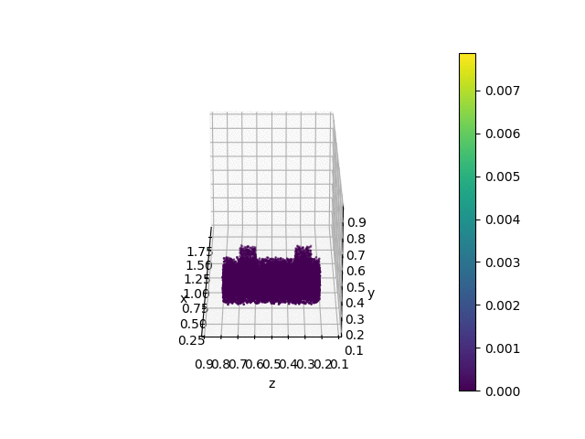

# Granular Flow Simulation Using `taichi_mpm`
Simulating sand mass collision using
[taichi mpm](https://github.com/taichi-dev/taichi_elements)

## Input
Using `input.json` file, granular mass can either be generated randomly in a 
specified domain, or can be placed manually.

```json
{
    "save_path": "./sand3d_collision/",
      "output_format": {  # Optional
        "timestep_downsampling_rate": 2,  # Downsample timestep, else, default is set to 1.0
        "material_feature": [  # Choose what material feature to include in the input npz
            "friction_angle",
            "elastic_modulus"
        ]
    },
    "id_range": [  # the id of simulations to generate
        0,
        10
    ],
    "domain_size": 1.0,  # the largest domain length (same for all dimension)
    "friction_angle": 35,
    "wall_friction": 0.43,
    "elastic_modulus": 2000000.0,
    "poisson_ratio": 0.3,
    "rho": 1800,
    "sim_space": [  # lower and upper boundary for each dimension 
        [
            0.2,
            0.8
        ],
        [
            0.2,
            0.8
        ],
        [
            0.2,
            0.8
        ]
    ],
    "sim_resolution": [
        32,
        32,
        32
    ],
    "nsteps": 350,  # number of forward steps
    "mpm_dt": 0.0025,  # time between forward steps
    "gravity": [0, -9.81, 0],
    "gen_cube_randomly": {
        "generate": true,
        "sim_inputs": {
            "mass": {
                "ncubes": [1, 2],
                "min_distance_between_cubes": 0.01,
                "cube_size_range": [[0.15, 0.3], [0.15, 0.3], [0.15, 0.3]],
                "cube_gen_space": [[0.11, 0.5], [0.11, 0.50], [0.11, 0.89]],
                "vel_range": [[3, 3], [-2.5, 2.5], [-2.5, 2.5]],
                "nparticle_limits": 15000
            },
            "obstacles": {
                "ncubes": [1, 2],
                "min_distance_between_cubes": 0.01,
                "cube_size_range": [[0.1, 0.1], [0.3, 0.3], [0.1, 0.1]],
                "cube_gen_space": [[1.0, 1.5], [0.10, 0.4], [0.15, 0.85]],
                "nparticle_limits": 7000
            }
        }
    },
    "gen_cube_from_data": {
        "generate": true,
        "sim_inputs": [
            {
                "id": 0,  # id of simulation
                "mass": {
                    "cubes": [
                        [
                            0.2,  # x corner 
                            0.2,  # y corner
                            0.2,  # z corner
                            0.2,  # x length
                            0.3,  # y length
                            0.4   # z length 
                        ],
                        "parcitles.csv"  # custom particle data
                    ],
                    "velocity_for_cubes": [
                        [
                            1.0,  # x vel
                            1.0,  # y vel
                            1.5   # z vel
                        ],
                        [
                             1.0, 
                             0.0,
                             -0.5   
                        ]
                    ]
                },
                "obstacles": null  # may repeat the as what is written in "mass" to add obstacles
            },
            {
              "id": 1  
                ...  # may repeat that is written in id 0 to add more simulations
            }
        ]
    },
    "visualization": {
        "is_realtime_vis": false,
        "is_save_animation": true,
        "skip": 1
    }
}
```
In the random generating case,
if `cube_size_range` is defined for all dimensions (e.g., `[[0.15, 0.3], [0.15, 0.3], [0.15, 0.3]]`),
the shape of cubes will be randomly generated following the specified values.
If `cube_size_range` is only defined for one dimension (e.g., `[0.1, 0.4]`), 
the shape of cubes will be square whose length is random from `[0.1, 0.4]`

#### Generate particles from user defined particle files
Simply append the file name to the `gen_cube_from_data["sim_inputs"]["mass"]["cubes"]` list.
The file format is as follows.
```shell
x, y
0.143, 0.123
0.243, 0.523
0.343, 0.423
...
```


## Output
The output is saved and `.npz` file. The code also saves simple `.gif` 
animation for the simulation. 

## Run
```shell
python3 run_mpm.py  --input_path="examples/sand2d/inputs_2d.json"
```

## Simulation Example



## Note
In taichi, coordinate y-axis corresponds to the height and y-axis corresponds 
to the plain. However, in matplotlib used in rendering, these axes are the opposite.
To deal with this problem, we transpose the axis of the taichi simulation results
(positions) when saving `.npz` files. 


