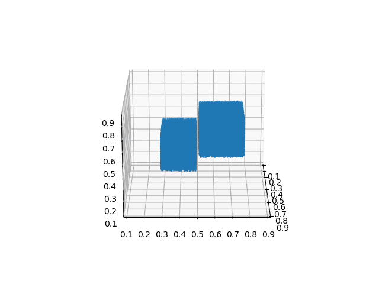

# Granular Flow Simulation Using `taichi_mpm`
Simulating sand mass collision using [taichi mpm](https://github.com/taichi-dev/taichi_elements)

## Input
Using `input.json` file, granular mass can either be generated randomly in a specified domain,
or can be placed manually.

```shell
{
  "save_path": "./sand3d_collision_test/",
  "id_range": [0,5],
  "domain_size": 1.0,
  "friction_angle": 35,
  "wall_friction": 0.43,
  "elastic_modulus": 2E6,
  "poisson_ratio": 0.3,
  "rho": 1800,
  "sim_space": [[0.2, 0.8], [0.2, 0.8], [0.2, 0.8]],
  "sim_resolution": [32, 32, 32],
  "nparticel_per_vol": 262152,
  "nsteps": 350,
  "mpm_dt": 0.0025,
  "gravity": -9.81,
  "gen_cube_randomly": {
    "generate": true,
    "ncubes": [2, 3],
    "min_distance_between_cubes": 0.01,
    "cube_size_range": [0.15, 0.35],
    "vel_range": [-2.5, 2.5],
    "cube_gen_space": [[0.21, 0.79], [0.21, 0.79], [0.21, 0.79]],
    "nparticle_limits": 20000
  },
  "gen_cube_from_data": {
    "generate": false,
    "cube_data": [
      {
        "id": 0,
        "cubes": [
          [0.20, 0.20, 0.35, 0.4, 0.2, 0.3]
        ],
        "velocity_for_cubes": [
          [2.0, 0.0, 0.0]
        ]
      }
    ],
    "obstacle_data": [
      {
        "id": 0,
        "cubes": [
          [1.0, 0.20, 0.45, 0.1, 0.2, 0.1]
        ],
        "velocity_for_cubes": [
          [0.0, 0.0, 0.0]
        ]
      }
    ]
  },
  "visualization":
  {
    "is_realtime_vis": true,
    "is_save_animation": true,
    "skip": 1
  }
}
```

## Output
The output is saved and `.npz` file. The code also saves simple `.gif` animation for the simulation. 

## Run
```shell
python3 mpm_collision.py
```

## Simulation Example



